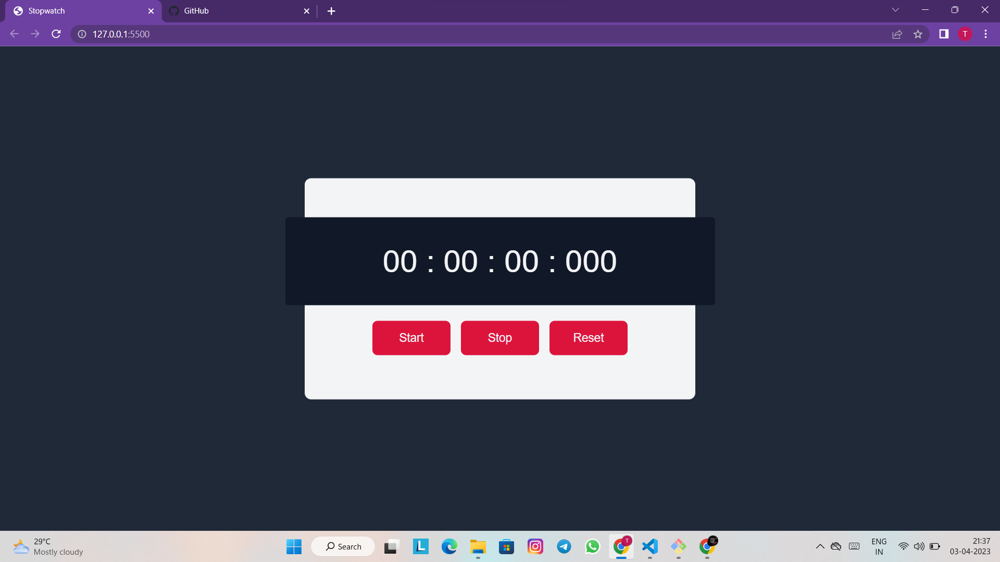

# Stopwatch using JavaScript

This is a simple stopwatch application built using JavaScript

## Description

This stopwatch application was built using HTML, CSS and JavaScript. It allows users to track time in hours, minutes, seconds and milliseconds ( HH:MM:SS.mmm ) with start, stop and reset functionalities. And also the stopwatch is completely responsive on different screen sizes.

## Technologies Used

* HTML
* CSS
* JavaScript

## Installation

1. Clone the repository <a href="https://github.com/Thirumalaikumar-M/Stopwatch-JavaScript.git">https://github.com/Thirumalaikumar-M/Stopwatch-JavaScript.git</a>
2. Open `index.html` in your preferred web browser

## Usage

To use the stopwatch, simply open the index.html file in your web browser or else try the <a href="https://thirumalaikumar-m.github.io/Stopwatch-JavaScript/">Github hosted page</a> . You will see a stopwatch interface with a start, stop and reset button. 

* To start the stopwatch, click the "Start" button. The timer will begin counting up from zero.
* To pause the stopwatch, click the "Stop" button. The timer will stop counting.
* To reset the stopwatch, click the "Reset" button. The timer will reset to zero.

## Screenshots

## Contributions

Contributions are welcome! Please open an issue or submit a pull request if you have any suggestions or improvements.

## License

This application is released under the . Feel free to use, modify and distribute your code under the terms of the MIT license.
